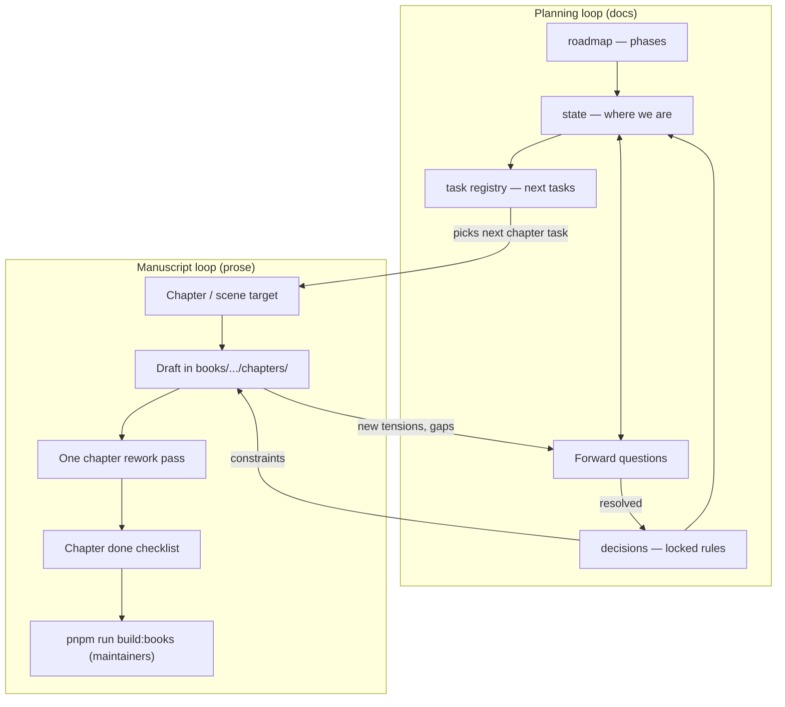
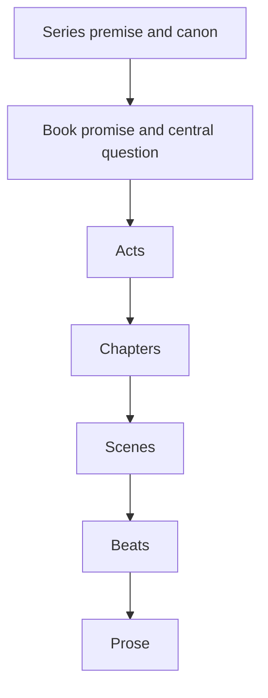

<Tabs defaultValue="resources" className="my-8">
<TabsList className="sticky top-16 z-20 mb-4 flex w-full flex-wrap gap-1 rounded-2xl border border-border/80 bg-dark-alt/90 p-1.5 backdrop-blur-md">
<TabsTrigger value="resources" className="rounded-xl px-4 py-2 text-sm font-medium data-[state=active]:bg-background data-[state=active]:text-foreground data-[state=active]:shadow-sm">Resources</TabsTrigger>
<TabsTrigger value="guide" className="rounded-xl px-4 py-2 text-sm font-medium data-[state=active]:bg-background data-[state=active]:text-foreground data-[state=active]:shadow-sm">Guide</TabsTrigger>
<TabsTrigger value="walkthrough" className="rounded-xl px-4 py-2 text-sm font-medium data-[state=active]:bg-background data-[state=active]:text-foreground data-[state=active]:shadow-sm">Walkthrough</TabsTrigger>
</TabsList>

<TabsContent value="resources" className="space-y-6 focus:outline-none">

## Downloads & Resources

<ManuscriptLoopResourcesHub />

</TabsContent>

<TabsContent value="guide" className="space-y-6 focus:outline-none">

## Introduction

This repository treats **long-form fiction** the same way it treats **code and documentation**: intent lives in **versioned planning artifacts**, execution lives in **files you can build and ship**, and the loop between them is **short, repeatable, and auditable**.

You should be able to open the repo—or the docs site—and see **what we decided**, **what we are drafting next**, and **how a chapter is supposed to behave**, without inferring all of that from prose alone.

The **books** section owns EPUB tooling, reader surfaces, and cross-title **Magicborn** continuity. Each **novel** also gets its own **`planning/`** folder with **`roadmap.mdx`**, **`state.mdx`**, **`task-registry.mdx`**, **`decisions.mdx`**, and **`AGENTS.md`**. Section-level planning under `content/docs/books/planning/` stays focused on **reader, publishing, and AI** work; story detail stays beside the manuscript.

### Worked example: Kael and *The Rune Path*

**Right now** this article is anchored to ***Magicborn: The Rune Path***—manuscript under `books/magicborn_rune_path/`, planning under `content/docs/books/magicborn-rune-path/planning/`. We use the same **agent-style** habits as engineering (external memory, one task id at a time, verification columns)—but the shipped surface is **prose and EPUB**, not a deployable service.

### How this article grows: checkpoints (journal, not a table)

This post is written like a **journal of making one book**—***Magicborn: The Rune Path***—so someone else can **repeat the loop**, not just read definitions.

Each **checkpoint** is a major `##` or `###` **section** in reading order. Inside that section we use the **same shape every time**:

1. **Planning phase (outcomes)** — What we locked or queued: excerpts or **snapshots** of `roadmap` / `state` / `task-registry` / `decisions` as they looked **at that moment** (via `CopyMarkdownSample`, links to docs, and/or files from the [planning pack](/planning-pack/manifest.json) path). Git history is the ultimate snapshot; the article quotes what readers need.

2. **Implementation phase (outcomes)** — What we actually changed in the repo: manuscript paths, task row status moves, shipped EPUB / reader checks, and (for maintainers) build verification. This is **what shipped** for that checkpoint.

3. **Conversation showcase** — A **scripted Assistant UI** thread (**Rune Path only**; no typing) that **reconstructs** the real author ↔ agent chat **that produced** those planning and implementation outcomes—condensed and anonymized only if needed. The script is a **museum label** next to the artifacts, not a second source of canon.

We add **another checkpoint section** after each time we complete that cycle, until the book is done. Planning and manuscript files stay **source of truth**; the article **narrates** them and does not invent locked canon (anything that reads like a rule belongs in `decisions.mdx`).

## Tradeoffs

### Planning-heavy versus “just write”

Tables and registries cost time. The return is **reviewability**: you can hand an agent (or a co-author) a **pointer**—state + one task id—instead of re-explaining the entire book every session.

### Beat-lock before polish

We deliberately **lock beats** for later chapters before we finish rework on an early chapter when policy says so—see [Mordred's Tale — Decisions](/docs/books/mordreds-tale/planning/decisions) for the “beats pass before Ch3 return” style locks. The tradeoff is **slower early gratification** for **fewer cascading retcons**.

### Build gate versus “it reads fine”

`pnpm run build:books` does not judge literary quality. It **does** judge that **paths, `book.json`, and chapter metadata** still compose into a valid EPUB. We use that as an **objective** gate alongside subjective chapter checklists.

### Agents versus solo drafting

Agents are optional. The **artifacts** are not. If you write solo, you still benefit from **state** as a honest pointer and **decisions** as stable ids for canon.

## What Was Done

We aligned every **Magicborn-line** stream with the same **record set** as the rest of the docs: **roadmap** (phases), **state** (narrative pointer + beat sheets), **task-registry** (queue), **decisions** (locks), plus **`AGENTS.md`** for **fiction-only** behavior. Section **books** planning keeps **reader / publishing / AI** phases separate from novel work.

### Artifact stack (section vs stream)

| Artifact | Section path | Per-novel path |
| --- | --- | --- |
| Requirements | `content/docs/books/requirements.mdx` | — |
| Roadmap | `planning/roadmap.mdx` | `<slug>/planning/roadmap.mdx` |
| State | `planning/state.mdx` | `<slug>/planning/state.mdx` |
| Task registry | `planning/task-registry.mdx` | `<slug>/planning/task-registry.mdx` |
| Decisions | `planning/decisions.mdx` | `<slug>/planning/decisions.mdx` |
| Fiction agent guide | — | `<slug>/planning/AGENTS.md` |

### Canonical article + per-book AGENTS

- **`AGENTS.md`** in each stream states **hard rules** and **read order** and **points here** for depth. That split is intentional: one repeatable article, many small agent entrypoints.
- For *The Rune Path*, **`AGENTS.md`** also covers **co-evolving this post** when the article is part of the same effort (**checkpoint sections** in journal form, no “demo-only” canon).

### Planning loop versus manuscript loop

**Planning** answers: *What is true in the story? What is locked? What is the next writing task? What is still open?*

**Manuscript work** answers: *What is on the page, in order, in this chapter?*

### Story vocabulary (planning grain)

| Term | Meaning |
| --- | --- |
| **Series** | The whole Magicborn-line arc across volumes; cross-book canon. |
| **Book / volume** | One published unit: one tree under `books/<slug>/`, one primary EPUB. |
| **Act** | A large movement inside one book. |
| **Arc** | A thread that **changes** over time (character, plot, or theme). |
| **Chapter** | Numbered manuscript unit under `chapters/`, with optional `chapter.json`. |
| **Scene** | Continuous time, place, and intention; one dominant outcome. |
| **Beat** | Smallest meaningful turn inside a scene. Beat sheets often bundle several beats per chapter row. |
| **Page** | A repo file (`001-page-….md`), a drafting chunk—not always one scene. |
| **Prose** | Implemented sentences. Planning is intent; prose is execution. |

### Layered model (filing intent)

| Atomic layer (metaphor) | Story analog |
| --- | --- |
| Atoms | Words, lines of dialogue |
| Molecules | Beats, exchanges |
| Organisms | Scenes |
| Templates | Chapter shape, act rhythm |
| Pages | Manuscript page files + assembled chapter |

### IDs and nomenclature

| Pattern | Example | Use |
| --- | --- | --- |
| Story decision | `MT-ENID-BRIGHT-SPELL-ARC` | Locked canon in decisions. |
| Forward / open question | `FQ-09`, `FQ-10` | Rows in state until promoted or struck. |
| Writing task | `mt-beats-01-ch07`, `mt-act2-01-ch4` | Task-registry rows with dependencies. |

When a question gets a real answer, it **graduates** to **decisions** with a stable id, and the open-question row is **resolved or removed** so state stays honest.

### Where the manuscript lives

Fiction source lives under repo-root **`books/`**: canonical full-source trees (e.g. `mordreds_tale/`) and optional **partition** volumes (`mordreds_tale_part_1/`, …) that pull chapter ranges without duplicating prose.

`pnpm run build:books` invokes **`@portfolio/repub-builder`**. Planning directories listed in each `book.json` are passed as **`--planning`** so author-facing notes can ship **inside the EPUB appendix** (not the TOC)—see the [planning supplement table](/docs/books/planning/planning-docs#epub-build-planning-supplement).

### Open questions as a running record

Forward questions live in **state** so the next session does not re-litigate the same uncertainty. When something is answered:

1. Add or update a row in **decisions** with a stable id.
2. Mark the question resolved in **state** (or remove the row).
3. If the answer changed the spine, bump **manuscript position** and **next queue** in the same edit.

### Verification (fiction)

- **Chapter gate:** beats landed, causality, handoff—per the [chapter done checklist](/docs/books/mordreds-tale/planning/task-registry#chapter-done-checklist-definition-of-done)—not line-perfect.
- **Build gate:** `pnpm run build:books` after changes that affect EPUB output or metadata.

### How this connects to the coding-agent article

The [coding agents post](/blog/using-coding-agents-effectively-with-roadmaps-and-planning-docs) argues for **small artifacts, one job each**, and a **live loop** instead of one static plan file. Fiction uses the same shape: **state** is the pointer, **task-registry** is the queue, **decisions** is the law, **roadmap** is the phase spine, and the manuscript is what you read in the [reader](/apps/reader) after a build.

<DocLinkCard
  href="/docs/books/mordreds-tale/planning/roadmap"
  title="Mordred's Tale — Roadmap"
  description="Phase-level mt-* timeline and dependency sketch."
/>

<DocLinkCard
  href="/docs/books/mordreds-tale/planning/state"
  title="Mordred's Tale — State"
  description="Acts, spine, beat sheets, narrative fronts, forward questions."
/>

<DocLinkCard
  href="/docs/books/mordreds-tale/planning/task-registry"
  title="Mordred's Tale — Task Registry"
  description="Writing phases and task ids with dependencies and verification."
/>

<DocLinkCard
  href="/docs/books/magicborn-rune-path/planning/state"
  title="Magicborn: The Rune Path — State"
  description="Kael prequel pointer: acts, timeline 17 vs 42, next queue."
/>

### Maintainer note: `build:books`

**Walkthrough** readers are assumed to use **shipped EPUBs** and **planning exports**—no local toolchain required. **Repo maintainers** still run **`pnpm run build:books`** after manuscript or `book.json` changes so the **canonical** EPUB and planning appendix stay valid.

## Conclusion

If you want to **write books the way we write software here**, the recipe is boring on purpose: **keep intent in planning docs**, **keep prose in `books/`**, **link decisions to ids**, **use per-book AGENTS.md for fiction sessions**, **re-read this article when the phase changes**, then **ship**—for maintainers that includes **running the build**; for readers of this tutorial it means using the **Resources** tab and **frozen checkpoints**. For *The Rune Path*, **add Walkthrough subsections** as you go so the article stays the **story of how the manuscript was produced**. Transparency is not a separate deliverable—it is what happens when the loop is real.

## Examples

The blocks below use **`CopyMarkdownSample`**: they **render as normal markdown** (tables, headings, lists) and you can **copy or download** the underlying `.md` for your own repo. Paste or adapt them into **checkpoint planning snapshots** when you freeze a moment in time.

### Example: beat sheet row (chapter planning)

<CopyMarkdownSample
  title="Beat sheet fragment (markdown)"
  filename="beat-sheet-chapter.md"
  markdown={`### Chapter 7 — Devil in the Register

| Field | Content |
| --- | --- |
| POV | Owain (locked for draft) |
| Primary job | Registry proves legal ownership; Jack near-miss; church cannot pull ward off Mordred row. |
| Alternatives | A) Public confrontation B) Quiet registry forgery — **pick one** before draft continues. |
| Locked for draft | A) Public confrontation — Merris pressure visible; Jack loses the paper argument on-page. |
| Moral / shock notes | Reader should feel the state’s paperwork as violence, not abstraction. |
`}
/>

### Example: task registry row

<CopyMarkdownSample
  title="Task row template"
  filename="task-registry-row.md"
  markdown={`| Id | Status | Goal | Depends | Verify |
| --- | --- | --- | --- | --- |
| mt-act2-01-ch7 | in-progress | Draft Chapter 8 — Devil in the Register; age/timeline aligned to Ch6–7 | mt-act2-01-ch6 | Chapter checklist + repo build gate (maintainers: pnpm run build:books) |
`}
/>

### Example: forward question promotion

<CopyMarkdownSample title="Forward question → decision" filename="fq-to-decision.md">
{`## State — Forward questions (fragment)

| Id | Question | Status |
| --- | --- | --- |
| FQ-09 | Who is Enid’s arranged match politically aligned with? | open |

## Decisions — new row after resolution

| Id | Status | Rule |
| --- | --- | --- |
| MT-ENID-FIANCE-HALRIC-HALLINGHORN | accepted | Prince Halric of Hallinghorn; entitled, dismissive to women and poor; pressure visible in Part I split chapters. |
`}
</CopyMarkdownSample>

### Example: EPUB planning dirs (as bullet spec)

<CopyMarkdownSample
  title="book.json planning pointers (markdown notes)"
  filename="epub-planning-notes.md"
  markdown={`## epubPlanningDirs (conceptual)

- Relative paths from the book folder (e.g. mordreds_tale/).
- Include section planning: apps/portfolio/content/docs/books/planning
- Include stream planning: apps/portfolio/content/docs/books/mordreds-tale/planning
- Or for Kael prequel: apps/portfolio/content/docs/books/magicborn-rune-path/planning
- Build resolves each existing directory and passes --planning to repub for appendix material.
`}
/>

### Example phase table (Book 2)

| Phase | Intent |
| --- | --- |
| `ml-outline-01` | Ch1 + plumbing; tighten Act I; name parents; confirm Kael at 42. |
| `ml-book2-02` | Acts II–III beat sheets; POV stickiness; align with Rune Path end-state. |
| `ml-book2-03` | Manuscript milestones Ch2+. |

Full detail: [Mordred's Legacy — Roadmap](/docs/books/mordreds-legacy/planning/roadmap).

### Example conversation (collapsible)

<ArticleDetails summary="Session transcript — agent + author (illustrative)">

**Author:** Open Mordred’s Tale task `mt-act2-01-ch7`. Recap Ch7 ending and what Owain knows.

**Agent:** Recap from **state** + last page files: Owain left the well scene with … (short). Ch8 needs registry beat and Jack near-miss per **Locked for draft**.

**Author:** Draft the registry scene only; do not fix Ch6 yet.

**Agent:** Prose added under `books/mordreds_tale/chapters/...`; no decision changes; one new line in **state** under workshop notes for Merris.

**Author:** Run build.

**Agent:** `pnpm run build:books` succeeded; task row still **in-progress** until checklist passes.

</ArticleDetails>

<ArticleDetails summary="Full chapter checklist (from task registry)">

| Check | Pass criteria |
| --- | --- |
| Beats landed | Required beats exist as scenes, not notes. |
| Scene causality | Each scene causes the next or creates pressure. |
| Character motive | POV motive explicit; flawed choices still readable. |
| Canon | Matches decisions + state. |
| Act handoff | Ending sets up next chapter objective. |
| Balance | Dialogue + interior beats; no endless exposition slab. |
| Placeholders | No TODO plot holes; polish wording optional. |
| Read-through | One pass for awkward transitions. |
| Build | build:books when applicable (maintainers). |

</ArticleDetails>

### Mermaid: one session, one task id

</TabsContent>

<TabsContent value="walkthrough" className="space-y-6 focus:outline-none">

## Checkpoints — making *The Rune Path* (journal)

The subsections below are the **running record** of the book. Each checkpoint uses **planning outcomes → implementation outcomes → conversation showcase**. As the novel advances, **add a new subsection**; keep older checkpoints so the path stays auditable.

### Checkpoint 1 — Act I spine after “The Sortie” (Ch1)

**Author (summary)** — Ch1 was already in the tree; we needed a **single planning task** to carry Act I forward without improvising in prose. We picked **`mrp-outline-01-03`**, agreed the escape beat had to **honor Ch1’s armory logic**, then split **planning closure** from **Ch2 drafting** so the registry stays honest.

**Agent (summary)** — Confirmed **`mrp-outline-01-03`** as next id; proposed a **public punishment / policy** trigger aligned with [`MRP-DUNGEON-RELIC-LAW`](/docs/books/magicborn-rune-path/planning/decisions) and the end of Ch1; drafted the **Ch2–4 beat table** and **forward questions** on [state](/docs/books/magicborn-rune-path/planning/state); moved **`mrp-outline-01-03`** to **`done`** and **`mrp-draft-01-01`** to **`in-progress`**; added **Chapter 2 — *The Breach*** opening page; **maintainers** verified EPUB output before freezing **Checkpoint 1** (see readers below).

#### Planning (outcomes)

- **Task closed:** [`mrp-outline-01-03`](/docs/books/magicborn-rune-path/planning/task-registry) — Act I beat sheet (post–Ch1) with verify on [state — Act I beat sheet](/docs/books/magicborn-rune-path/planning/state#act-i-beat-sheet--postch1-locked-for-draft).
- **Forward questions added:** `FQ-MRP-01`–`03` on [state](/docs/books/magicborn-rune-path/planning/state#forward-questions-the-rune-path) (border name, barracks ally, sniffer shape).
- **No new `MRP-*` decisions** this pass — carved-rune rules stay **`proposed`** until Ch3 uses sniffers on-page ([`mrp-outline-01-04`](/docs/books/magicborn-rune-path/planning/task-registry)).

<CopyMarkdownSample
  title="Snapshot — Act I beat sheet (excerpt)"
  filename="mrp-checkpoint1-act1-beats-excerpt.md"
  markdown={`## Act I beat sheet — post–Ch1 (locked for draft)

| Ch | Working title | Primary job | Escape trigger / turn | First Path / magic | Locked for draft |
| --- | --- | --- | --- | --- | --- |
| **2** | **The Breach** | Break Host compliance; Kael runs | Public morning reckoning: punishment for a relic breach… | He leaves with minimal kit; no full mark yet… | Yes — trigger is spectacle of punishment… |
| **3** | **The Hound** | Pursuit on the road… | … | Latent mark: faded carve… | Yes — … |
| **4** | **First waypoint** | Contact or station… | … | Named waypoint… | Yes — conductor stays unnamed in planning until… |
`}
/>

#### Implementation (outcomes)

- **Manuscript:** `books/magicborn_rune_path/chapters/02-chapter-2-the-breach/chapter.json` and `01.md` — Ch2 opens the **morning reckoning** beat and ends on the road out of Tarro (no carve yet; echoes Ch1’s closing).
- **Planning files touched:** `content/docs/books/magicborn-rune-path/planning/state.mdx`, `task-registry.mdx`.
- **Shipped EPUB:** **Checkpoint 1** is frozen as [`/books/magicborn_rune_path/checkpoints/cp01/book.epub`](/books/magicborn_rune_path/checkpoints/cp01/book.epub); the **canonical** EPUB updates with later work (see the **Resources** tab on this page).
- **Reader:** use the embeds below — **cp01** matches this checkpoint; **latest** tracks the moving manuscript.

#### Reader — Checkpoint 1 vs latest

<BookReaderEmbed slug="magicborn_rune_path" checkpoint="cp01" title="Magicborn: The Rune Path" />

<BookReaderEmbed slug="magicborn_rune_path" title="Magicborn: The Rune Path (latest)" />

#### Conversation showcase

Scripted **Assistant UI** thread (**Rune Path**, **Checkpoint 1**): four suggested prompts reconstruct **this** planning → implementation arc (condensed from how we worked; not a second canon source). The composer matches **site chat** styling but stays **read-only**—only the chips send messages.

<FictionLoopDemo />

<Callout type="info" title="Why the composer is read-only">
**Suggested prompts** advance the tutorial in order. Markdown in the thread is rendered for readability. In your own repo you type freely; here the UI is **exhibit-style** for the blog.
</Callout>

### Checkpoint 2 — *Next*

*Add the next journal section here after the next full planning → implementation cycle.*

</TabsContent>

</Tabs>
