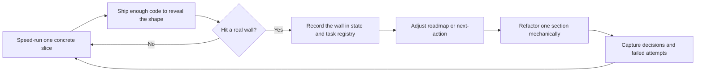
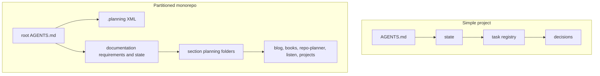

Eric J. Ma's October 14, 2025 post on coding agents is useful because it makes two points that matter: agents need a real workflow, and they need external memory. I agree with both. I especially agree with the speed-run idea: write enough code to find the wall, because you cannot reliably infer the right design pattern before the system has enough surface area to reveal one.

Where I diverge is the default prescription that the safest generic answer is TDD first and early refactoring. On greenfield work with agents, that often bakes in the wrong abstraction too early. I would rather let the code get concrete, let the agent run into constraints, and then refactor mechanically by section once the pattern is visible. That is also why the "plan only" approach never worked as well for me as the planning docs we use now. A single plan file is easy to admire and easy to ignore. A live loop is harder to fake.

## Downloads & Resources

- [Eric J. Ma's article](https://ericmjl.github.io/blog/2025/10/14/how-to-use-coding-agents-effectively/) is the post this essay responds to.
- [Documentation - Requirements](/docs/documentation/requirements) is the canonical monorepo narrative for how this repository uses planning artifacts.
- [Documentation - State](/docs/documentation/planning/state) is the cross-cutting queue where shared next actions stay visible.
- [Global planning guide](/docs/global/global-planning) explains the two-layer model: root `.planning` XML plus section-local `planning/` folders.
- [Repo Planner - Getting started](/docs/repo-planner/getting-started) documents the minimal init flow, the planning-pack pipeline, and the embedded cockpit.

<Callout type="tip" title="Planning pack modal">
The article below references both the demo planning pack and the built-in Repo Planner init pack. Open the same modal used by the rest of the site if you want to inspect those files while you read.
</Callout>

<PlanningPackButton label="Open the planning pack modal" />

## Introduction

The core mistake I see in a lot of coding-agent advice is pretending that uncertainty can be eliminated before enough code exists. It cannot. In data work you do not identify a stable pattern from two points. In software you do not identify a stable abstraction from one half-finished slice and a guess about the future.

That is why I keep the part of Eric's argument about iteration and discard the part that treats early refactoring as obviously good. If an agent is still discovering the shape of the system, premature abstraction is usually damage, not progress. The right move is to get enough implementation on the board, find the real repetition, then refactor in a way that is mechanical, reviewable, and scoped to one part of the system.

In this repository, that stance shows up in the planning loop itself. The [global planning guide](/docs/global/global-planning) explains how the root agent guide and root `.planning/*.xml` own monorepo gates. The docs tree owns the public planning records. The [documentation roadmap](/docs/documentation/roadmap), [state](/docs/documentation/planning/state), section task registries, decisions, and errors-and-attempts are not supporting documents around the work. They are the work's memory.

## Tradeoffs

### TDD can give an agent feedback, but it can also freeze a bad guess

I understand the argument for tests-first: the agent gets a tight loop and a visible definition of done. That is real value. But on exploratory greenfield work, failing tests can still encode the wrong boundary, wrong interface, and wrong naming scheme. The agent then optimizes toward a specification that was too confident too early.

I would rather speed-run a vertical slice, let the agent prove where the architecture bends, and only then harden that area with tests that describe something I now believe in.

### Blanket refactoring is worse with agents than with humans

When a human says "refactor all this," they may still carry an internal model of the codebase. An agent often does not. Broad refactor asks encourage wide, weakly grounded edits. The safer pattern is narrower: pick one section, one class of files, or one repeated interaction and refactor that mechanically.

That is also easier to record in the planning loop. One task row, one verification path, one decision if the refactor changed a stable rule.

### Plan-only docs decay faster than narrow artifact docs

I tried keeping plans in the repo and telling the agent to follow them. That still underperformed compared to the Ralph Wiggum loop we use now. The reason is simple: a generic plan does not answer enough small operational questions.

What is active right now? That is state. What are the executable units? That is the task registry. What is the phase boundary? That is roadmap. What is now a rule? That is decisions. What failed and should not be relearned from scratch next week? That is errors and attempts.

Once each artifact owns one job, the agent stops smearing intent across one giant planning document.

## What Was Done

### What I keep from Eric's article

Eric is right that effective agent use is not prompt magic. It is workflow, memory, and iteration. He is also right that external memory matters. In this repo that memory is not only `AGENTS.md`; it is the whole chain of [requirements](/docs/documentation/requirements), [state](/docs/documentation/planning/state), [roadmap](/docs/documentation/roadmap), section task registries, decisions, and errors-and-attempts, plus the root `.planning` XML for Repo Planner.

He is also right about speed-runs. The fastest way I have found to make agents useful is to let them move until they hit something real. A fake wall discovered in planning is still fake. A real wall discovered in code tells you where the next refactor belongs.

### The loop I actually want agents to follow



This is the loop I trust more than "write tests for everything first, then refactor early and often." The key move is not refusing tests. The key move is refusing fake certainty.

### The artifact stack matters more than the perfect prompt

| Artifact | Job | Reevaluate it when |
| --- | --- | --- |
| `roadmap` | defines phase boundaries and cross-section sequencing | one phase starts mixing unrelated streams or stops predicting what comes next |
| `state` | points at the immediate focus and next queue | it reads like a dumping ground instead of a pointer |
| `task-registry` | breaks work into executable ids with verification | rows are too coarse to review or too vague to finish |
| `decisions` | turns repeated judgment calls into stable rules | the shipped code no longer matches the rule |
| `errors-and-attempts` | preserves dead ends, regressions, and mitigations | the team keeps rediscovering the same failure mode |

That table is the practical reason the planning docs beat the plan-only approach for me. Each artifact is small enough to stay honest.

### State and roadmap should be reevaluated as the project grows

One state file and one roadmap can be enough for a small project. They stop being enough when the project becomes partitioned and the question "what is next?" has multiple valid answers depending on section, audience, or runtime.

| Situation | Good enough | Time to split |
| --- | --- | --- |
| single app, one delivery stream | one state file, one registry, one decisions page | not yet |
| multiple public sections but shared deployment | root state plus section registries | when the root queue gets noisy |
| monorepo with product, docs, tooling, and embedded apps | root `.planning` plus public section planning folders | immediately |

That is exactly what happened here. The recent [documentation-site-10](/docs/documentation/planning/task-registry) planning IA reset moved section planning into literal `planning/` folders because the flat structure had stopped helping. The root `.planning/*.xml` files remained useful for monorepo and Repo Planner concerns, but the section-local loops became necessary because the repository had outgrown a single undifferentiated planning surface.

### Simple project versus partitioned project



The important thing is not complexity for its own sake. The important thing is preserving legibility. If the state file stops telling the truth quickly, split it. If the roadmap stops describing coherent phases, rewrite it. If the task registry is too broad to review, partition it.

### Refactoring should be scoped, mechanical, and traceable

My working rule with agents is simple: do not ask for a giant, future-facing cleanup pass unless the code has already demonstrated the pattern and the target scope is clear. Ask for the refactor that can be reviewed against one task id, one affected section, and one verification path.

That is why I prefer section-scoped refactors and why I want the public docs to make artifact ownership explicit. The refactor should map back to a row. The row should map back to a phase. If the change establishes a new rule, it should land in decisions. If it fixes a repeated mistake, it should land in errors and attempts.

<DocLinkCard
  href="/docs/documentation/requirements"
  title="Documentation - Requirements"
  description="Canonical narrative for root versus section planning, planning-pack policy, and the living-loop artifact set."
/>

<DocLinkCard
  href="/docs/global/global-planning"
  title="Global planning guide"
  description="The clearest public explanation of the root XML layer, section planning folders, task-id grammar, and planning-pack boundaries."
/>

<DocLinkCard
  href="/docs/repo-planner/getting-started"
  title="Repo Planner - Getting started"
  description="Minimal init, `pnpm planning:init`, embedded cockpit policy, and the difference between bare `.planning` and full upstream init."
/>

## Conclusion

Using coding agents effectively is less about forcing perfect foresight and more about building enough code to make the real constraints visible. I agree with the speed-run, external-memory part of the advice. I do not agree that TDD-first and early refactoring should be treated as the universal default.

For me, the better pattern is: build until the wall is real, record the wall in the planning artifacts, then refactor one section mechanically. That is why I trust roadmap, state, task-registry, decisions, and errors-and-attempts more than a standalone plan file. They do not just describe intent. They preserve the conversation between intent, implementation, and correction.

## Examples

### Example 1: a simple project can stay very small

If the system is still one stream with one owner, this is enough:

```text
my-app/
  AGENTS.md
  requirements.mdx
  planning/
    roadmap.mdx
    planning-docs.mdx
    state.mdx
    task-registry.mdx
    decisions.mdx
```

The state page can be brutally short:

```md
## Current cycle

| Field | Value |
| --- | --- |
| `phase` | `app-01` |
| `focus` | ship one vertical slice end to end |

## Next queue

| Priority | Action |
| --- | --- |
| `1` | `app-01-01`: build the first slice |
```

### Example 2: once the project is partitioned, the planning model should change too

This repository now needs both a root machine-facing layer and section-local public records:

```text
custom_portfolio/
  AGENTS.md
  .planning/
    AGENTS.md
    STATE.xml
    TASK-REGISTRY.xml
    ROADMAP.xml
    DECISIONS.xml
    ERRORS-AND-ATTEMPTS.xml
    REQUIREMENTS.xml
  apps/portfolio/content/docs/global/
    requirements.mdx
    planning/
      roadmap.mdx
      state.mdx
      task-registry.mdx
      decisions.mdx
  apps/portfolio/content/docs/documentation/
    requirements.mdx
    planning/
      roadmap.mdx
      state.mdx
      task-registry.mdx
      decisions.mdx
  apps/portfolio/content/docs/blog/planning/
  apps/portfolio/content/docs/repo-planner/planning/
```

A real task row from a planning-heavy writing pass should look specific enough to verify:

```md
| `blog-content-03-03` | `done` | publish a long-form article on coding-agent workflow with diagrams, planning-artifact examples, and a planning-pack modal CTA | `blog-discovery-01-04`, `blog-identity-01-02` | `pnpm run build`, `pnpm run lint` |
```

A real "do not relearn this" row belongs in errors and attempts, not buried in prose:

```md
| `blog-content-03-attempt-01` | `resolved` | agent-workflow writing | plan-only docs stored in the repo were less effective than a living artifact stack with narrow responsibilities | anchor future workflow writing to roadmap, state, task-registry, decisions, and errors-and-attempts |
```

### Example 3: the Repo Planner init sample pack is useful because it stays concrete

The minimal init path documented in [Repo Planner - Getting started](/docs/repo-planner/getting-started) is exactly the kind of example I want agents to learn from:

```bash
pnpm planning:init
```

That produces a bare root planning section instead of a giant mixed bag:

```text
.planning/
  AGENTS.md
  planning-config.toml
  STATE.xml
  TASK-REGISTRY.xml
  ROADMAP.xml
  DECISIONS.xml
  ERRORS-AND-ATTEMPTS.xml
  REQUIREMENTS.xml
```

The planning-pack modal shows two useful views of that idea:

- `Demo` shows the starter template set: `EXAMPLE-planning-docs.md`, `EXAMPLE-state.md`, `EXAMPLE-task-registry.md`, and a generic `AGENTS.md`.
- `Site` shows exported planning docs from this repository's sections.
- The Repo Planner cockpit also preloads built-in packs such as `rp-builtin-init` and `rp-builtin-docs`, which make the same shape inspectable inside the app.

<PlanningPackButton label="Preview the demo pack and site exports" />

If you want the live tool instead of the read-only modal, open [Repo Planner](/apps/repo-planner). If you want the public explanation of why the model is split this way, read [Documentation - Requirements](/docs/documentation/requirements) and the [Global planning guide](/docs/global/global-planning).
