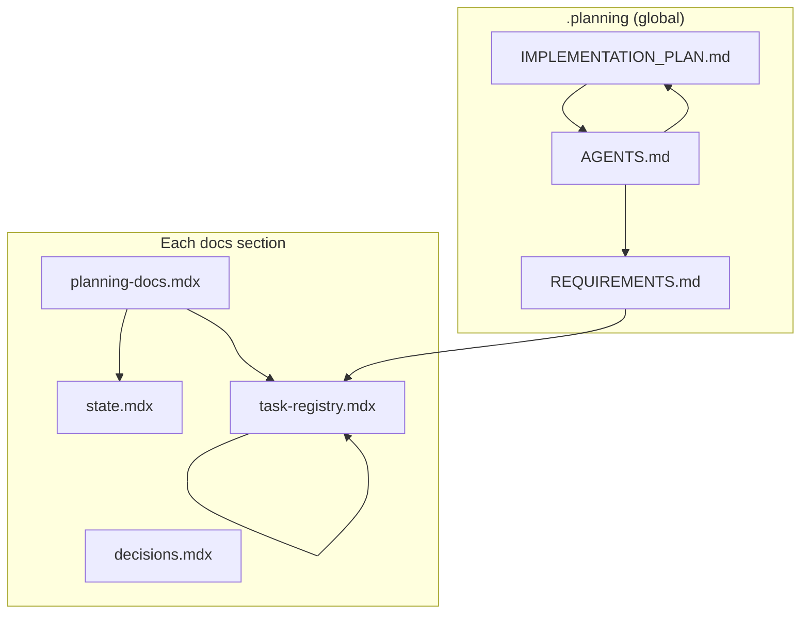
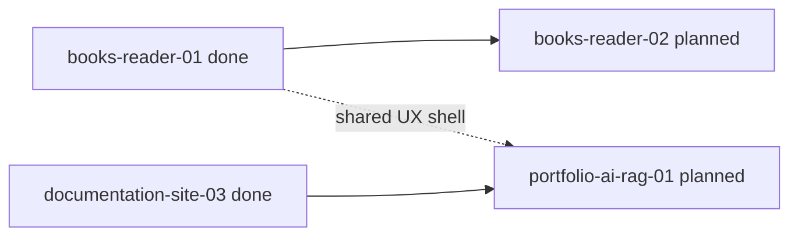
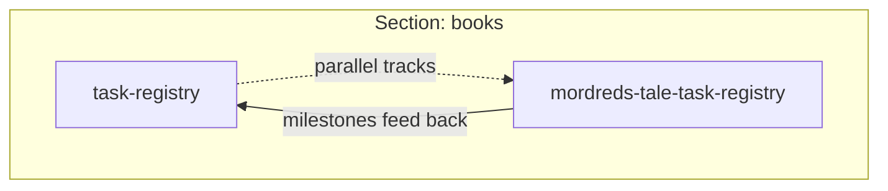

# Global planning

This page is the **human index** for planning across the monorepo. **Authoritative gates and long-form requirements** stay in [`.planning/REQUIREMENTS.md`](../../../../../.planning/REQUIREMENTS.md), [`.planning/IMPLEMENTATION_PLAN.md`](../../../../../.planning/IMPLEMENTATION_PLAN.md), and root **`AGENTS.md`**. **Section-owned work** lives under `apps/portfolio/content/docs/<section>/` (state, task registry, decisions, and optional sub-project registries such as a single book’s task list).

## Layers

| Layer | Location | Owns |
| --- | --- | --- |
| Global | `.planning/*.md`, root `AGENTS.md` | Cross-cutting requirements, release gates, monorepo read order, links into sections |
| Section | `content/docs/<section>/` | Phases and tasks scoped to that product area (books, documentation, editor, …) |
| Sub-project (optional) | Same section, extra pages (e.g. `mordreds-tale-task-registry`) | Long streams inside a section without crowding the main registry |

**Rule of thumb:** if work only touches one section’s code and audience, its **task id** lives in that section’s **task registry**. If it spans CI, multiple apps, or site-wide behavior, track it in **global** (`IMPLEMENTATION_PLAN.md` / `REQUIREMENTS.md`) and mirror detail in a section when useful.

## ID shape (at a glance)

Use a **fixed segment order** so ids parse left to right:

`<namespace>-<stream>-<phase>[-<task>]`

| Segment | Meaning |
| --- | --- |
| `namespace` | Partition key: matches the docs folder and known sections in `apps/portfolio/lib/docs.ts` (`books`, `documentation`, `editor`, `dialogue-forge`, `blog`, `magicborn`, …). |
| `stream` | Product line inside that section (e.g. books: `reader`, `publishing`, `ai`; documentation: `site`; editor: `workflow`). Prefer stable stream names over one-off topics. |
| `phase` | `01`, `02`, … or `01a` for a decimal insert between phases. |
| `task` | `01`, `02`, … within the phase (omit only when naming a phase as a whole). |

**Examples**

| Id | Reads as |
| --- | --- |
| `books-reader-03-02` | Books → reader stream → phase 3 → task 2 |
| `books-publishing-01-01` | Books → EPUB / build / pipeline |
| `documentation-site-03-04` | Documentation section → docs-site work → phase 3 → task 4 |
| `editor-workflow-02-01` | Editor section → authoring toolchain |
| `global-release-01-02` | Optional prefix for repo-wide-only tasks (lint gates, submodules) when not folded into `IMPLEMENTATION_PLAN` prose |

**Frontmatter helpers** (section pages): keep `repoPath`, `taskPhase`, and (when useful) a stable `section` value aligned with the namespace above. See [Planning Docs](/docs/documentation/planning-docs).

## Cross-reference conventions

| Direction | Pattern |
| --- | --- |
| Global → section | Link the live path: `/docs/<section>/task-registry` and name the **phase id** (e.g. “phase `books-reader-03`”). |
| Section → global | Point to `.planning/REQUIREMENTS.md` or `IMPLEMENTATION_PLAN.md` and name the **section or table** (e.g. “Reader + AI roadmap”). |
| Anchors | Prefer explicit ids in registries (`task-id` column) over prose-only mentions so grep and agents stay aligned. |

Root **read order** for agents is defined in **`AGENTS.md`** (global first for monorepo gates, then the relevant section’s **planning-docs** → **state** → **task-registry**).

## Workflow: global and section loops

## Workflow: phase dependencies (example)

*Illustrative only:* rename or replace nodes when you add a dedicated **AI / RAG** namespace or section.

## Workflow: section vs sub-project registry (example)

## Mermaid in docs

Fenced blocks with language `mermaid` render on the site. Exported planning-pack `.md` files keep the same fences so offline readers and tools that support Mermaid can render them.

## See also

- [Planning Docs](/docs/documentation/planning-docs) — documentation section loop and id rules for `documentation-site-*`
- [State](/docs/documentation/state) — current documentation-section cycle
- [Task registry](/docs/documentation/task-registry) — executable tasks and phases for the docs site
