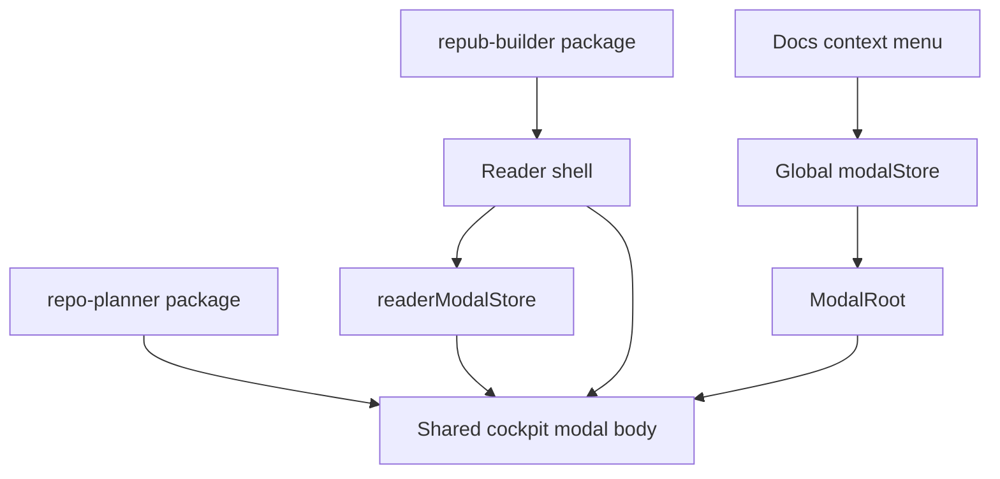

# Reader shell + Repo Planner embed architecture

**Intent:** Treat **`@portfolio/repub-builder`** (reader **shell** + EPUB runtime) and **`repo-planner`** (Planning **cockpit** UI) as **libraries structured for reuse**. **v1:** the **only** consumer of the reader runtime is **`apps/portfolio`** (**`BOOKS-READER-V1-PORTFOLIO-HOST-ONLY`**); third-party embed docs and API stability can follow once the shell ships. The **portfolio** remains the **host** that wires env, routes, and **second entry points** (e.g. docs file-tree context menu) into the **same** cockpit experience the reader uses.

This page complements [Route conventions](/docs/documentation/route-conventions), [Repo Planner -- Planning docs](/docs/repo-planner/planning/planning-docs), and [books task registry](/docs/books/planning/task-registry) phase **`books-reader-03`**.

## Reader workspace -- locked product choices

Aligned with [books -- decisions](/docs/books/planning/decisions): **`BOOKS-READER-DASHBOARD-CHROME`**, **`BOOKS-READER-V1-PORTFOLIO-HOST-ONLY`**, **`BOOKS-READER-MOVE-EPUBVIEWER-WITH-WORKSPACE`**, **`BOOKS-READER-THEME-BUNDLED-PARITY`**, **`BOOKS-READER-QUERY-URL-V1`**, **`BOOKS-READER-SHADCN-IN-REPUB-BUILDER`**.

| Topic | Choice |
| --- | --- |
| **Extraction scope** | **`ReaderWorkspace` + `EpubViewer`** (and lazy boundary) **together** in **repub-builder** |
| **v1 consumer** | **`@portfolio/app` only** |
| **Sidebar** | **Library**, **current book**, **Settings** -- **no** team/workspace switcher |
| **Main (inset)** | **Shelf** = **searchable EPUB catalog**, **Unity Asset Store-style** (search/filters, dense grid); **or** full **`EpubViewer`** when reading |
| **Toolbar** | Breadcrumb/title, **planning strip** toggle, **theme** (ember/ink), download when applicable, **EPUB upload** (**file picker** + **drag-and-drop**) |
| **Theme** | **Bundled** in package; **ember/ink** reader chrome (**persisted**) |
| **Routing** | **Query params** for v1; path-based reader URLs **later** |
| **shadcn** | **Allowed** inside **repub-builder** for dashboard primitives; peer vs bundle in RFC (**`books-reader-03-01`**) |
| **Planning strip** | **`ReaderPlanningStrip`** lives **inside** the **repub-builder** reader workspace (same package as **`ReaderWorkspace`**). It uses **`readerModalStore`** + **`ReaderModalRoot`** to open the shared cockpit body -- **no** portfolio **`renderPlanningStrip`** wrapper and **no** global **`useModalStore`** on the strip (**`BOOKS-READER-PLANNING-STRIP-PACKAGE-READER-MODAL-STORE`**) |

## Book-scoped planning packs vs site built-in packs

**Target behavior (see [books decisions](/docs/books/planning/decisions) `BOOKS-READER-PLANNING-PACK-FROM-BOOK-ARTIFACT`, `BOOKS-REPUB-ARTIFACT`):**

| Source | Role |
| --- | --- |
| **Per-book EPUB / repub artifact** | **Canonical** planning material for **that title** when the user is reading a **repo-built** book. Produced at build time from the manuscript folder plus **`epubPlanningDirs`** in `book.json` (or CLI **`repub epub <book-folder> --planning <dir>`** repeated per tree). Content is already **inside the EPUB** as **planning supplement** appendix XHTML (not TOC entries) — see [books planning-docs](/docs/books/planning/planning-docs). |
| **Site `public/planning-embed/builtin-packs.json`** | Loaded **only** outside the reader planning modal: **`/apps/repo-planner`** and the **global** `RepoPlannerModal` (**`loadSiteBuiltinPacks`** default **`true`**). **Reader workspace** passes **`loadSiteBuiltinPacks={false}`** — **no** site built-in packs in that cockpit; only **book workspace** packs (**`books-reader-04`**) belong there. |

**Shipped (`books-reader-04`):** **`EpubViewer`** reports loaded bytes to **`ReaderWorkspace`**; **`ReaderModalRoot`** passes them into **`renderPlanningCockpit`**. **`RepoPlannerCockpitClient`** runs **`extractPlanningPackFromEpub`** (manifest at **`META-INF/portfolio-planning-pack.json`**, else **`OEBPS/plan-*.xhtml`** fallback) and prefers that pack (**id** `book-<slug>-planning`). **`public/planning-embed/book-packs/<slug>.json`** remains an **optional fallback** (regenerate with **`pnpm planning:embed-book-pack`** only when needed — not part of default **`dev`/`build`**). Spec: [books — EPUB planning pack manifest](/docs/books/planning/plans/books-reader-04-epub-planning-pack).

## Repub file (formal reading artifact) -- target

Today the CLI already distinguishes **RichEPub** (`.repub` via **`repub build`**) from **EPUB3** (via **`repub epub`**). The **direction** is to treat the **portfolio reading unit** for a built title as a **repub reading bundle** (working name **repub file**): at minimum **EPUB3** plus a declared set of **embedded planning supplements** and **author annotations** merged at build time. The **reader workspace** should **discover** that bundle when loading **`/books/<slug>/book.epub`** (or a future **`.repub`** drop-in) and feed **cockpit + annotations** from the same artifact — not from unrelated site docs URLs.

Manifest: **`META-INF/portfolio-planning-pack.json`** (see spec link above). Optional sidecar JSON is still a documented optimization only.

## Layer model

| Layer | Owns | Does not own |
| --- | --- | --- |
| **`repo-planner`** (upstream / npm) | `PlanningCockpit`, workspace chrome, assumptions about host `cn` + shadcn aliases (documented in INSTALL) | Portfolio modal store, Next `app/` routes, book-specific payloads |
| **`@portfolio/repub-builder`** | EPUB viewer, annotations, **`ReaderWorkspace`**, **`ReaderPlanningStrip`** on **`readerModalStore`**, **top toolbar** + **inset** (shelf search, filters, DnD EPUB, or **`EpubViewer`**), **`ReaderModalRoot`**. **Site shell:** host **`SidebarProvider` / `SidebarInset`** + **`SidebarTrigger`** in the reader toolbar | Global **`useModalStore`** / **`ModalRoot`** -- **not** used by the strip; host passes **`renderPlanningCockpit`** into **`ReaderWorkspace`** |
| **`@portfolio/app`** | **Global** `ModalRoot`, **registry** of modal ids, **docs** context actions, `transpilePackages`, env for `REPOPLANNER_PROJECT_ROOT`, API route mounting | Duplicated cockpit **business** UI -- should import **one** composed `RepoPlannerCockpitModal` (or body) from **repub-builder** or a thin **`@portfolio/planning-embed`** facade if we split later |

## Target: one cockpit modal **body**, two **open** paths

| Entry | Mechanism | Payload example |
| --- | --- | --- |
| **Reader planning strip** | **`ReaderPlanningStrip`** in **`@portfolio/repub-builder/reader`** calls **`readerModalStore.openPlanningCockpit({ ... })`**; **`ReaderModalRoot`** renders **`renderPlanningCockpit`** from the host (e.g. **`RepoPlannerCockpitClient`**) | Payload (neutral): `readingTargetId`, optional `surfaceLabel`, `quickLinks` — legacy `bookSlug` still accepted; see **`reader-book-modal-payloads`**. Cockpit **prefers** planning extracted from the **loaded EPUB**; **`/planning-embed/book-packs/<slug>.json`** is **fallback** for legacy EPUBs or failed extraction |
| **Portfolio layout** | `useModalStore.openModal(REPO_PLANNER_MODAL_ID, payload)` -- **same** modal **body component** imported from repub-builder (or shared export) | Same payload shape; registry wrapper only supplies `onClose` + portal z-index |
| **Docs file tree** (context menu on planning folder) | **Host** `openModal(REPO_PLANNER_MODAL_ID, { ... })` | **New:** e.g. `planningFolderPrefix: 'books/planning'` or `initialPackFromArchive: '/api/docs/archive*prefix=...'` -- *needs product decision* |

**Rule:** Implement **`RepoPlannerCockpitModalBody`** (name TBD) **once** -- heavy `RepoPlannerCockpitClient` + dashboard + optional book context. **Two hosts** render that body: **`RepoPlannerModal`** (portfolio **`ModalRoot`** registry) and **`ReaderModalRoot`** (subscribes to **`readerModalStore`** only). The **planning strip** is **not** a portfolio injectable slot -- it **ships with** the reader workspace and **only** talks to **`readerModalStore`**.

## Migration sequence (suggested)

1. **Extract modal body** -- Pull inner content of today's `RepoPlannerModal` (everything below the header, or including a configurable header) into an exportable module. **Dependency direction:** that module imports `repo-planner` / `PlanningCockpitDashboard` as today, not `@/app`.
2. **Add `readerModalStore`** in **repub-builder** (or under `src/reader/modal-store.ts`) -- same API shape as needed: `openRepoPlanner`, `close`, optional `activeId` union for future reader-only modals.
3. **Reader shell** mounts **`ReaderModalRoot`** (small) next to workspace -- only subscribes to **`readerModalStore`**; does not replace site-wide **`ModalRoot`**.
4. **Move `ReaderPlanningStrip`** into **repub-builder** with the workspace; replace **`useModalStore`** calls with **`readerModalStore`** (task **`books-reader-03-07`**).
5. **Portfolio** `modal-registry` registers **`RepoPlannerModal`** that re-exports or wraps the **same body**; strip duplicate layout code from `components/modals/repo-planner/RepoPlannerModal.tsx` to a one-liner re-export if possible.
6. **Docs** -- extend file-tree context menu with "Open in planning cockpit" -> build payload from `folderArchivePrefix` / section path; document payload contract here and in [Repo Planner planning docs](/docs/repo-planner/planning/planning-docs).

## Publishability checklist (both major projects)

| Concern | repo-planner | repub-builder |
| --- | --- | --- |
| **Peer deps** | `react`, `react-dom`; document required CSS / Tailwind content paths | `react`, `react-dom`, `react-reader`, `framer-motion`, ... |
| **Path aliases** | Replace or document `@/vendor/repo-planner/*` for consumers | No `@/` imports; only `repo-planner` + relative |
| **Exports map** | `"."` cockpit; optional `"./planning-cockpit"` | `"."` CLI; **`"./reader"`** → `src/reader/index.ts` (source; Next **`transpilePackages`**) |
| **Consumer Next** | `transpilePackages: ['repo-planner']` | `transpilePackages: ['@portfolio/repub-builder']` |

## Task registry links

| Phase | Where |
| --- | --- |
| Reader shell + repub runtime | [books -- `books-reader-03`](/docs/books/planning/task-registry) -- extend with embed/modal rows (see below) |
| Cockpit embed + publish | [repo-planner -- `repo-planner-integration-02`](/docs/repo-planner/planning/task-registry) |
| Host wiring + docs context menu | [documentation -- `documentation-site-08`](/docs/documentation/planning/task-registry) |

## Open questions (need your answers)

1. **Store boundaries** -- **Reader planning strip:** **`readerModalStore`** only (**locked** -- **`BOOKS-READER-PLANNING-STRIP-PACKAGE-READER-MODAL-STORE`**). **Open:** whether **two** stores forever (**global** site + **reader-scoped**) for *other* modals vs one **shared** store package (heavier coupling)*
2. **Docs folder -> cockpit** -- Should opening from a **planning** folder **preload** an uploaded "pack" from that subtree (ZIP via `/api/docs/archive`), **seed** `localStorage` workspace, or only **deep-link** to a future tab that lists "open pack from prefix"* This drives payload shape and API use.
3. **Package split** -- If **repub-builder** must not depend on **repo-planner** (optional reader without planning), should the shared modal body live in a tiny **`@portfolio/planning-cockpit-embed`** used by both, or is **repub-builder -> peerDep `repo-planner`** acceptable*
4. **Branding / npm scope** -- Confirm publish names: e.g. **`@magicborn/repo-planner`** and **`@magicborn/repub-builder`** vs current `@portfolio/*` private packages.
5. **Modal stacking** -- If both reader and global modals could open (edge case), should reader modals use a **lower z-index** band than site `ModalRoot`, or is **exclusive** focus (close reader modal when opening site modal) enough*

---

When these are decided, update [decisions](/docs/documentation/planning/decisions) with ids **`DOCUMENTATION-READER-COCKPIT-EMBED-*`** and mirror consequences under [books/decisions](/docs/books/planning/decisions) if the reader shell owns the behavior.
