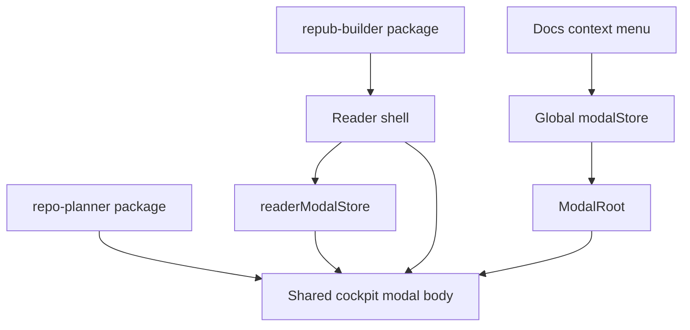

# Reader shell + Repo Planner embed architecture

**Intent:** Treat **`@portfolio/repub-builder`** (reader **shell** + EPUB runtime) and **`repo-planner`** (Planning **cockpit** UI) as **first-class libraries** other apps import. The **portfolio** remains a **host** that wires env, routes, and **second entry points** (e.g. docs file-tree context menu) into the **same** cockpit experience the reader uses.

This page complements [Route conventions](/docs/documentation/route-conventions), [Repo Planner -- Planning docs](/docs/repo-planner/planning/planning-docs), and [books task registry](/docs/books/planning/task-registry) phase **`books-reader-03`**.

## Layer model

| Layer | Owns | Does not own |
| --- | --- | --- |
| **`repo-planner`** (upstream / npm) | `PlanningCockpit`, workspace chrome, assumptions about host `cn` + shadcn aliases (documented in INSTALL) | Portfolio modal store, Next `app/` routes, book-specific payloads |
| **`@portfolio/repub-builder`** | EPUB viewer, annotations, **reader shell** layout, **reader-scoped modal store** for overlays that must work when the app is embedded without the full site chrome | Global site modals (planning pack hero, command palette) unless host passes a bridge |
| **`@portfolio/app`** | **Global** `ModalRoot`, **registry** of modal ids, **docs** context actions, `transpilePackages`, env for `REPOPLANNER_PROJECT_ROOT`, API route mounting | Duplicated cockpit **business** UI -- should import **one** composed `RepoPlannerCockpitModal` (or body) from **repub-builder** or a thin **`@portfolio/planning-embed`** facade if we split later |

## Target: one cockpit modal **body**, two **open** paths

| Entry | Mechanism | Payload example |
| --- | --- | --- |
| **Reader planning strip** | `readerModalStore.openRepoPlanner({ ... })` inside **repub-builder** shell; shell renders portal/modal locally | Today: `bookSlug`, `planningLinks`, `embedReader` -- see `reader-book-modal-payloads` |
| **Portfolio layout** | `useModalStore.openModal(REPO_PLANNER_MODAL_ID, payload)` -- **same** modal **body component** imported from repub-builder (or shared export) | Same payload shape; registry wrapper only supplies `onClose` + portal z-index |
| **Docs file tree** (context menu on planning folder) | **Host** `openModal(REPO_PLANNER_MODAL_ID, { ... })` | **New:** e.g. `planningFolderPrefix: 'books/planning'` or `initialPackFromArchive: '/api/docs/archive*prefix=...'` -- *needs product decision* |

**Rule:** Implement **`RepoPlannerCockpitModalBody`** (name TBD) **once** -- heavy `RepoPlannerCockpitClient` + dashboard + optional book context. **Thin** wrappers: `RepoPlannerModal` (portfolio registry) and **reader-internal** modal host both render that body.

## Migration sequence (suggested)

1. **Extract modal body** -- Pull inner content of today's `RepoPlannerModal` (everything below the header, or including a configurable header) into an exportable module. **Dependency direction:** that module imports `repo-planner` / `PlanningCockpitDashboard` as today, not `@/app`.
2. **Add `readerModalStore`** in **repub-builder** (or under `src/reader/modal-store.ts`) -- same API shape as needed: `openRepoPlanner`, `close`, optional `activeId` union for future reader-only modals.
3. **Reader shell** mounts **`ReaderModalRoot`** (small) next to workspace -- only subscribes to `readerModalStore`; does not replace site-wide `ModalRoot`.
4. **Portfolio** `modal-registry` registers **`RepoPlannerModal`** that re-exports or wraps the **same body**; strip duplicate layout code from `components/modals/repo-planner/RepoPlannerModal.tsx` to a one-liner re-export if possible.
5. **Docs** -- extend file-tree context menu with "Open in planning cockpit" -> build payload from `folderArchivePrefix` / section path; document payload contract here and in [Repo Planner planning docs](/docs/repo-planner/planning/planning-docs).

## Publishability checklist (both major projects)

| Concern | repo-planner | repub-builder |
| --- | --- | --- |
| **Peer deps** | `react`, `react-dom`; document required CSS / Tailwind content paths | `react`, `react-dom`, `react-reader`, `framer-motion`, ... |
| **Path aliases** | Replace or document `@/vendor/repo-planner/*` for consumers | No `@/` imports; only `repo-planner` + relative |
| **Exports map** | `"."` cockpit; optional `"./planning-cockpit"` | `"."` CLI; `"./react"` or `"./reader"` shell + modal body |
| **Consumer Next** | `transpilePackages: ['repo-planner']` | `transpilePackages: ['@portfolio/repub-builder']` |

## Task registry links

| Phase | Where |
| --- | --- |
| Reader shell + repub runtime | [books -- `books-reader-03`](/docs/books/planning/task-registry) -- extend with embed/modal rows (see below) |
| Cockpit embed + publish | [repo-planner -- `repo-planner-integration-02`](/docs/repo-planner/planning/task-registry) |
| Host wiring + docs context menu | [documentation -- `documentation-site-08`](/docs/documentation/planning/task-registry) |

## Open questions (need your answers)

1. **Store boundaries** -- Do you want **two** Zustand stores forever (**global** site + **reader-scoped**), with the cockpit body as a dumb child, or one **shared** store package used by both (heavier coupling)*
2. **Docs folder -> cockpit** -- Should opening from a **planning** folder **preload** an uploaded "pack" from that subtree (ZIP via `/api/docs/archive`), **seed** `localStorage` workspace, or only **deep-link** to a future tab that lists "open pack from prefix"* This drives payload shape and API use.
3. **Package split** -- If **repub-builder** must not depend on **repo-planner** (optional reader without planning), should the shared modal body live in a tiny **`@portfolio/planning-cockpit-embed`** used by both, or is **repub-builder -> peerDep `repo-planner`** acceptable*
4. **Branding / npm scope** -- Confirm publish names: e.g. **`@magicborn/repo-planner`** and **`@magicborn/repub-builder`** vs current `@portfolio/*` private packages.
5. **Modal stacking** -- If both reader and global modals could open (edge case), should reader modals use a **lower z-index** band than site `ModalRoot`, or is **exclusive** focus (close reader modal when opening site modal) enough*

---

When these are decided, update [decisions](/docs/documentation/planning/decisions) with ids **`DOCUMENTATION-READER-COCKPIT-EMBED-*`** and mirror consequences under [books/decisions](/docs/books/planning/decisions) if the reader shell owns the behavior.
