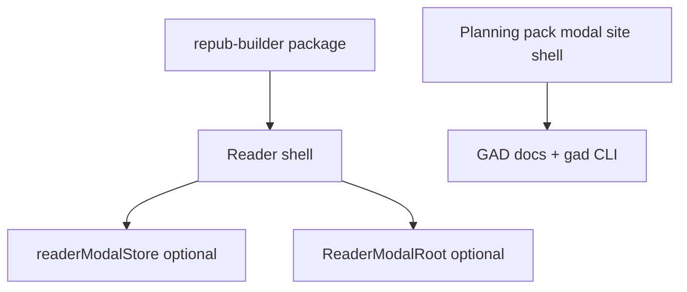

# Reader shell + planning artifacts (GAD era)

**Supersedes:** Earlier drafts described a **shared Repo Planner cockpit** inside the reader (`renderPlanningCockpit`, `RepoPlannerCockpitClient`). That path is **removed** from the portfolio app (2026-04). **GAD** is the planning loop (**`gad`**, `.planning/` files, compiled docs); the site **Planning pack** modal handles **downloads / ZIPs** for visitors.

**Intent:** **`@portfolio/repub-builder`** owns the **reader shell** + EPUB runtime. The portfolio host wires **nav**, **persistence**, and optional **`renderReaderModal`** — it does **not** pass a planning cockpit today. **v1 consumer** remains **`apps/portfolio`** only (**`BOOKS-READER-V1-PORTFOLIO-HOST-ONLY`**).

This page complements [Route conventions](/docs/documentation/route-conventions), [Repo Planner planning docs](/docs/repo-planner/planning/planning-docs) (archive / migration), and [books task registry](/docs/books/planning/task-registry).

## Reader workspace -- locked product choices

Aligned with [books -- decisions](/docs/books/planning/decisions): **`BOOKS-READER-DASHBOARD-CHROME`**, **`BOOKS-READER-V1-PORTFOLIO-HOST-ONLY`**, **`BOOKS-READER-MOVE-EPUBVIEWER-WITH-WORKSPACE`**, **`BOOKS-READER-THEME-BUNDLED-PARITY`**, **`BOOKS-READER-QUERY-URL-V1`**, **`BOOKS-READER-SHADCN-IN-REPUB-BUILDER`**.

| Topic | Choice |
| --- | --- |
| **Extraction scope** | **`ReaderWorkspace` + `EpubViewer`** (and lazy boundary) **together** in **repub-builder** |
| **v1 consumer** | **`@portfolio/app` only** |
| **Sidebar** | **Library**, **current book**, **Settings** -- **no** team/workspace switcher |
| **Main (inset)** | **Shelf** = **searchable EPUB catalog**, **Unity Asset Store-style** (search/filters, dense grid); **or** full **`EpubViewer`** when reading |
| **Toolbar** | Breadcrumb/title, **planning strip** toggle, **theme** (ember/ink), download when applicable, **EPUB upload** (**file picker** + **drag-and-drop**) |
| **Theme** | **Bundled** in package; **ember/ink** reader chrome (**persisted**) |
| **Routing** | **Query params** for v1; path-based reader URLs **later** |
| **shadcn** | **Allowed** inside **repub-builder** for dashboard primitives; peer vs bundle in RFC (**`books-reader-03-01`**) |
| **In-reader modal** | **`ReaderModalRoot`** + optional host **`renderReaderModal`** — portfolio **omits** both for planning; no planning strip or cockpit in the default reader |

## Book-scoped planning packs vs site built-in packs

**Target behavior (see [books decisions](/docs/books/planning/decisions) `BOOKS-READER-PLANNING-PACK-FROM-BOOK-ARTIFACT`, `BOOKS-REPUB-ARTIFACT`):**

| Source | Role |
| --- | --- |
| **Per-book EPUB / repub artifact** | **Canonical** planning material for **that title** when the user is reading a **repo-built** book. Produced at build time from the manuscript folder plus **`epubPlanningDirs`** in `book.json` (or CLI **`repub epub <book-folder> --planning <dir>`** repeated per tree). Content is already **inside the EPUB** as **planning supplement** appendix XHTML (not TOC entries) — see [books planning-docs](/docs/books/planning/planning-docs). |
| **Site `public/planning-embed/builtin-packs.json`** | Consumed by the **Planning pack** site modal and embed builders — **not** by an in-reader cockpit. |

**Artifacts (`books-reader-04`):** Built books can still embed planning supplements in the EPUB (manifest **`META-INF/portfolio-planning-pack.json`**, **`OEBPS/plan-*.xhtml`** fallback). **`@portfolio/repub-builder/planning-pack`** exposes **`extractPlanningPackFromEpub`** for **hosts that choose** to wire downloads or a custom modal; the **portfolio reader does not** mount **`RepoPlannerCockpitClient`**. Optional **`public/planning-embed/book-packs/<slug>.json`** — **`pnpm planning:embed-book-pack`**. Spec: [books — EPUB planning pack manifest](/docs/books/planning/plans/books-reader-04-epub-planning-pack).

## Repub file (formal reading artifact) -- target

Today the CLI already distinguishes **RichEPub** (`.repub` via **`repub build`**) from **EPUB3** (via **`repub epub`**). The **direction** is to treat the **portfolio reading unit** for a built title as a **repub reading bundle** (working name **repub file**): at minimum **EPUB3** plus **embedded planning supplements** and **author annotations** merged at build time. The reader **loads** that artifact; any **planning UI** is optional host responsibility (downloads / future modal), not a bundled Repo Planner cockpit.

Manifest: **`META-INF/portfolio-planning-pack.json`** (see spec link above). Optional sidecar JSON is still a documented optimization only.

## Layer model

| Layer | Owns | Does not own |
| --- | --- | --- |
| **`@portfolio/repub-builder`** | EPUB viewer, annotations, **`ReaderWorkspace`**, toolbar + inset (shelf / **`EpubViewer`**), optional **`ReaderModalRoot`** + **`renderReaderModal`** | Repo Planner cockpit; global site **`ModalRoot`** |
| **`@portfolio/app`** | Reader host wrapper, **Planning pack** modal, GAD doc routes, `transpilePackages` / APIs until **06-03** | In-reader interactive planning cockpit (removed) |
| **Upstream `repo-planner`** | Reference package + parsers still imported by APIs/tests during migration | Product surface on this site |

## Planning entry (portfolio)

| Entry | Mechanism |
| --- | --- |
| **Legacy app URL** | **[`/apps/repo-planner`](/apps/repo-planner)** → **redirect** to [GAD planning state](/docs/get-anything-done/planning/state). |
| **Downloads** | **Planning pack** control in the site shell (starter template + site Markdown exports). |
| **Reader workspace** | No planning modal in the default portfolio host; optional **`renderReaderModal`** remains available for **other** consumers of **`@portfolio/repub-builder`**. |
| **Global `ModalRoot`** | No Repo Planner cockpit modal. |

## Historical note

Earlier milestones described a **shared cockpit modal** (`RepoPlannerModal`, `ReaderPlanningStrip`, `renderPlanningCockpit`). The portfolio **closed** that approach in favor of **GAD + Planning pack downloads**. **`readerModalStore` / `ReaderModalRoot`** remain in **repub-builder** for **non-planning** or third-party hosts if needed.

## Publishability checklist (both major projects)

| Concern | repo-planner | repub-builder |
| --- | --- | --- |
| **Peer deps** | `react`, `react-dom`; document required CSS / Tailwind content paths | `react`, `react-dom`, `react-reader`, `framer-motion`, ... |
| **Path aliases** | Replace or document `@/vendor/repo-planner/*` for consumers | No `@/` imports; only `repo-planner` + relative |
| **Exports map** | `"."` cockpit; optional `"./planning-cockpit"` | `"."` CLI; **`"./reader"`** → `src/reader/index.ts` (source; Next **`transpilePackages`**) |
| **Consumer Next** | `transpilePackages: ['repo-planner']` | `transpilePackages: ['@portfolio/repub-builder']` |

## Task registry links

| Phase | Where |
| --- | --- |
| Reader shell + repub runtime | [books -- `books-reader-03`](/docs/books/planning/task-registry) -- extend with embed/modal rows (see below) |
| Cockpit embed + publish | [repo-planner -- `repo-planner-integration-02`](/docs/repo-planner/planning/task-registry) |
| Host wiring + docs context menu | [documentation -- `documentation-site-08`](/docs/documentation/planning/task-registry) |

## Follow-ups (optional)

- **Docs → downloads:** Whether the docs file tree should link **“Download this section’s planning export”** (ZIP / manifest) instead of any cockpit deep-link — product decision; **Planning pack** modal already covers site-wide exports.
- **Publishability** table above remains useful for **`repub-builder`** consumers; **`repo-planner`** row is **migration-only** until **06-03** removes the dependency.
