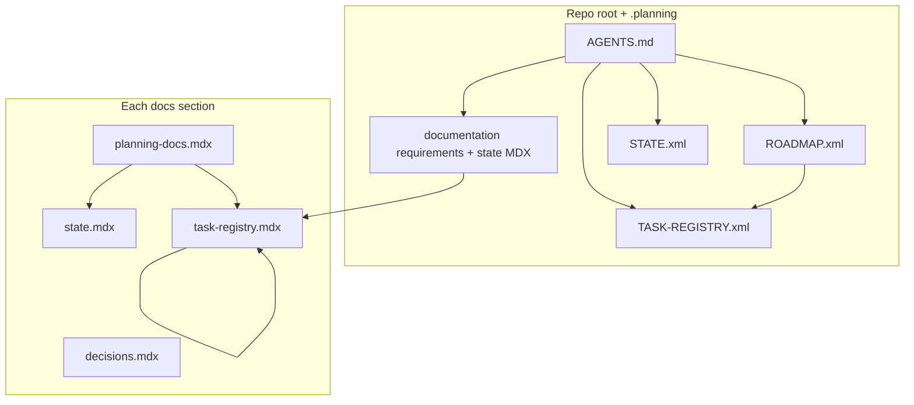
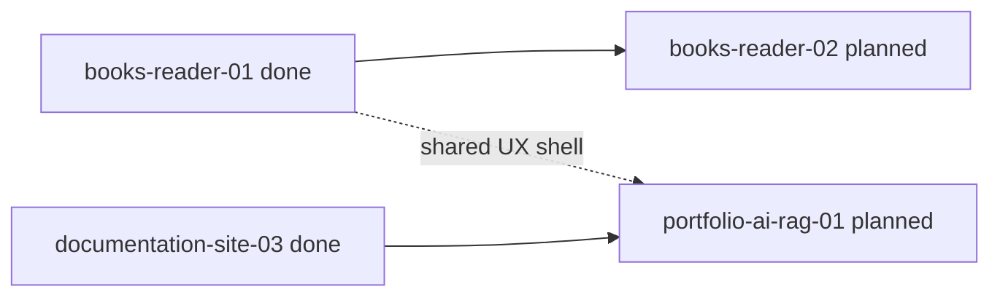
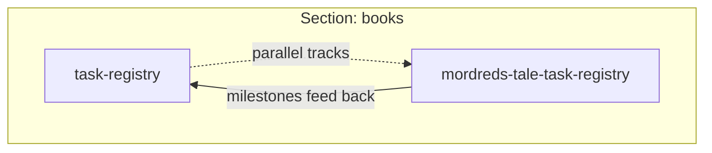

# Global planning guide

**Reference page** -- diagrams, layers, and conventions. The **Global** section **planning loop** (registry tables, current state, task rows) lives under **[Planning docs](/docs/global/planning/planning-docs)** -> [State](/docs/global/planning/state) -> [Task registry](/docs/global/planning/task-registry) -> [Decisions](/docs/global/planning/decisions), same pattern as other docs sections.

This page is the **human index** for planning across the monorepo. **Authoritative monorepo requirements** live in **[Documentation -- Requirements](/docs/documentation/requirements)**; the **cross-cutting queue** in **[Documentation -- State](/docs/documentation/planning/state)**. **Execution** lives in **`.planning/ROADMAP.xml`**, **`.planning/TASK-REGISTRY.xml`**, **`.planning/STATE.xml`**, plus section planning records. Root **[`AGENTS.md`](../../../../../AGENTS.md)** is the agent entrypoint. Repo-root **`REQUIREMENTS.md`** is a **stub pointer** only -- do not grow narrative there. **`.planning/REQUIREMENTS.xml`** is a machine stub pointing at the documentation paths. **`IMPLEMENTATION_PLAN.md`** is a legacy compatibility pointer at most, not the living source of truth. **Section-owned work** should converge on `apps/portfolio/content/docs/<section>/planning/` (or equivalent route-mapped folder) for state, task registry, decisions, roadmap, and optional sub-project registries such as a single book's task list.

**`.planning/`** is the **root planning section** (XML); same workflow as a docs section, different format. **RepoPlanner** consumes those files. **`pnpm planning`** / **`pnpm planning:snapshot`** are **optional** for operators. Default workflow: **edit in git** or use the **Repo Planner cockpit** ([`/apps/repo-planner`](/apps/repo-planner)) for analysis and UI-side edits, then export/commit. **Dialogue Forge** ships at **`/apps/dialogue-forge`** (not `/dialogue-forge`). URL taxonomy: [Route conventions](/docs/documentation/route-conventions). RepoPlanner wiring: [Getting started](/docs/repo-planner/getting-started), [Decisions](/docs/repo-planner/planning/decisions), [Planning docs](/docs/repo-planner/planning/planning-docs).

## Layers

| Layer | Location | Owns |
| --- | --- | --- |
| Root + `.planning` | **`.planning/*.xml`**, **`planning-config.toml`**, **`.planning/AGENTS.md`**, root **`AGENTS.md`**, **[documentation/requirements](/docs/documentation/requirements)**, **[documentation/state](/docs/documentation/planning/state)**, **[documentation/roadmap](/docs/documentation/roadmap)** | Monorepo gates, XML task graph, human-readable requirements + cross-cutting queue + overview table |
| Section | `content/docs/<section>/planning/` | Phases and tasks scoped to that product area (books, documentation, editor, ...) |
| Sub-project (optional) | Same section, extra pages (e.g. `mordreds-tale-task-registry`) | Long streams inside a section without crowding the main registry |

**Rule of thumb:** if work only touches one section's code and audience, its **task id** lives in that section's **task registry**. If it spans CI, multiple apps, or site-wide behavior, track it in **[documentation/state](/docs/documentation/planning/state)** (cross-cutting queue), **`.planning/TASK-REGISTRY.xml`**, or **`.planning/ROADMAP.xml`**, and mirror detail in a section when useful.

## ID shape (at a glance)

Use a **fixed segment order** so ids parse left to right:

`<namespace>-<stream>-<phase>[-<task>]`

| Segment | Meaning |
| --- | --- |
| `namespace` | Partition key: matches the docs folder and known sections in `apps/portfolio/lib/docs.ts` (`books`, `documentation`, `editor`, `dialogue-forge`, `blog`, `magicborn`, `repo-planner`, ...). |
| `stream` | Product line inside that section (e.g. books: `reader`, `publishing`, `ai`; documentation: `site`; editor: `workflow`). Prefer stable stream names over one-off topics. |
| `phase` | `01`, `02`, ... or `01a` for a decimal insert between phases. |
| `task` | `01`, `02`, ... within the phase (omit only when naming a phase as a whole). |

**Examples**

| Id | Reads as |
| --- | --- |
| `books-reader-03-02` | Books -> reader stream -> phase 3 -> task 2 |
| `books-publishing-01-01` | Books -> EPUB / build / pipeline |
| `books-ai-01-04` | Books -> ai stream -> phase 1 -> task 4 |
| `documentation-site-03-04` | Documentation section -> docs-site work -> phase 3 -> task 4 |
| `editor-workflow-02-01` | Editor section -> authoring toolchain |
| `global-release-01-02` | Optional prefix for repo-wide-only tasks (lint gates, submodules) when not folded into `.planning/TASK-REGISTRY.xml` |

**Frontmatter helpers** (section pages): keep `repoPath`, `taskPhase`, and (when useful) a stable `section` value aligned with the namespace above. See [Documentation planning](/docs/documentation/planning/planning-docs).

## Phases, sprints, and RepoPlanner

[RepoPlanner](https://github.com/MagicbornStudios/RepoPlanner) treats a **sprint** (or release train) as a **collection of phases** with stable ids--each phase has PLAN/SUMMARY material under `.planning/phases/<phase-id>/` in XML. **This repo adopts that idea in two places:**

| Layer | What you use |
| --- | --- |
| **Docs site (MDX)** | Each section should group its planning records under `content/docs/<namespace>/planning/` with the same *status / task / phase* vocabulary: `planning-docs` -> `state` -> `task-registry` -> `decisions` -> optional `roadmap` and `plans/`. Namespace + stream + phase + task ids match the table above. |
| **Repo root (`.planning`)** | **`ROADMAP.xml`** carries RepoPlanner-shaped milestones; **`STATE.xml` / `TASK-REGISTRY.xml`** carry the agent loop; phase folders hold per-phase XML after **full** init. Day-to-day **next work** lives in those XML files + **[documentation/requirements](/docs/documentation/requirements)** / **[state](/docs/documentation/planning/state)** -- see [Repo Planner -- Getting started](/docs/repo-planner/getting-started#planning-files-what-to-use-when). |

**Rule:** Prefer **one phase id** to mean the same thing in MDX task tables and in `.planning/phases/` folder names so the cockpit, CLI, and site stay aligned.

## Cross-reference conventions

| Direction | Pattern |
| --- | --- |
| Global -> section | Link the live path: `/docs/<section>/task-registry` and name the **phase id** (e.g. "phase `books-reader-03`"). |
| Section -> global | Point to **[documentation/requirements](/docs/documentation/requirements)**, **[documentation/state](/docs/documentation/planning/state)**, **`.planning/ROADMAP.xml`**, or **`.planning/TASK-REGISTRY.xml`** and name the **phase or queue row**. |
| Anchors | Prefer explicit ids in registries (`task-id` column) over prose-only mentions so grep and agents stay aligned. |

Root **read order** for agents is defined in **`AGENTS.md`** (global first for monorepo gates, then the relevant section's **planning-docs** -> **state** -> **task-registry**).

## One-off plans

**Rule:** roadmap, state, task registry, and decisions are the **living loop**. If a phase needs a temporary implementation or research plan, store it under that section's planning folder, for example:

- `content/docs/<section>/planning/plans/<phase-id>/PLAN.mdx`
- `content/docs/<section>/planning/plans/<phase-id>/SUMMARY.mdx`
- `content/docs/<section>/planning/plans/<phase-id>/UAT.mdx`

Those documents support the phase; they do **not** replace the roadmap or task registry as the source of truth.

## Workflow: global and section loops

## Workflow: phase dependencies (example)

## Workflow: section vs sub-project registry (example)

## Mermaid in docs

Fenced blocks with language `mermaid` render on the site. Exported planning-pack `.md` files keep the same fences so offline readers and tools that support Mermaid can render them.

<strong>Planning without this repository's layout</strong>

Many projects use a single **STATE**, **TASK-REGISTRY** (or Kanban), and **ROADMAP** (or milestone list). The shape matters more than the filenames: short loops, explicit task ids, and a clear "what's next" for humans and agents.

[RepoPlanner](https://github.com/MagicbornStudios/RepoPlanner) is a reference implementation: XML templates, CLI (`pnpm planning` in this repo), and optional **local** tooling. This portfolio vendors it under `vendor/repo-planner`; see [Repo Planner -- Getting started](/docs/repo-planner/getting-started).

<strong>Downloadable planning pack (read-only)</strong>

At build time, section planning MDX is mirrored to **`/planning-pack/site/*.md`** plus **`/planning-pack/manifest.json`** (see the homepage **Planning pack** modal). That export is **read-only** for visitors: static Markdown, no write-back to the repo.

**Not included in the public pack:** **`.planning/*.xml`** and the full **documentation/requirements** + **state** source used for monorepo gates are **not** mirrored as a single "requirements download" in the gallery export (the pack is **section planning MDX -> `.md`**). Operators share **`.planning/`** via git or local RepoPlanner exports -- not the public planning-pack gallery.

<strong>RepoPlanner cockpit vs this site (boundary)</strong>

| Surface | Who | Mutability |
| --- | --- | --- |
| **Live RepoPlanner UI** (`pnpm planning:ui` = local report viewer; full cockpit when embedded per [INSTALL](https://github.com/MagicbornStudios/RepoPlanner/blob/main/INSTALL.md)) | Operators on **your machine** | Edit and **export**; commit results to git |
| **Portfolio production** | Visitors | **Read-only** -- static MDX, planning-pack downloads, and any future **upload-to-view** flow must stay **ephemeral** (same idea as the in-app **reader**: nothing long-lived on the server, no production "AI edits the repo"). |

The public embed is **read-only on the server** (**GET** bundle; **POST** apply/CLI **403** unless explicitly enabled). Cockpit UI is allowed; operators export and commit from git. See [Repo Planner -- Decisions](/docs/repo-planner/planning/decisions) **`REPOPLAN-EMBED-01`**.

## See also

- [Planning docs](/docs/global/planning/planning-docs) -- Global section planning loop (state, task registry, decisions)
- [Apps hub](/apps) -- operator gallery (Repo Planner, planning pack, EPUB reader)
- [Repo Planner cockpit](/apps/repo-planner) -- embedded **PlanningCockpit** (live `.planning` via API)
- [Repo Planner](/docs/repo-planner/planning/planning-docs) -- submodule, CLI, local-only cockpit policy
- [Documentation planning](/docs/documentation/planning/planning-docs) -- docs-site section loop and `documentation-site-*` ids
- [Vendoring](/docs/documentation/vendoring) -- submodules including `vendor/repo-planner`
- [Architecture conventions](/docs/documentation/architecture-conventions) -- product boundaries and layering (engineering-focused)
