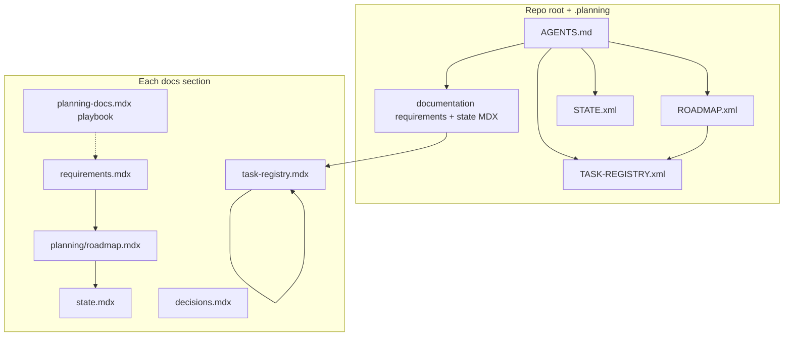
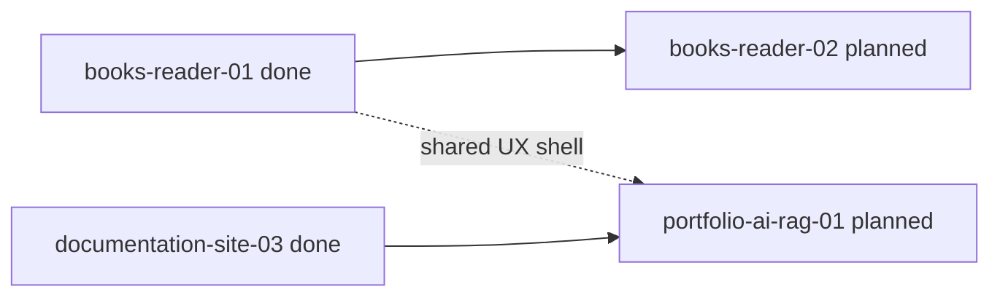
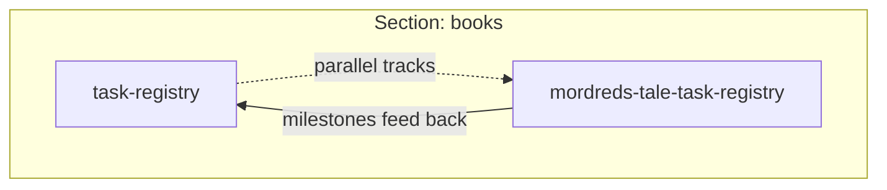

# Global planning guide

**Reference page** -- diagrams, layers, and conventions. The **Global** section keeps its local playbook in **[Planning docs](/docs/global/planning/planning-docs)**, while the living section records now follow **[Requirements](/docs/global/requirements)** -> **[Roadmap](/docs/global/planning/roadmap)** -> [State](/docs/global/planning/state) -> [Task registry](/docs/global/planning/task-registry) -> [Decisions](/docs/global/planning/decisions), same pattern as other docs sections.

This page is the **human index** for planning across the monorepo. The **Global** section is the human-first entrypoint for agents and operators. **Authoritative monorepo requirements** live in **[Documentation -- Requirements](/docs/documentation/requirements)**; the **cross-cutting queue** in **[Documentation -- State](/docs/documentation/planning/state)**. **Execution** lives in **`.planning/ROADMAP.xml`**, **`.planning/TASK-REGISTRY.xml`**, **`.planning/STATE.xml`**, plus section planning records. Root **[`AGENTS.md`](../../../../../AGENTS.md)** is the operational entrypoint that points back to Global. Repo-root **`REQUIREMENTS.md`** is a **stub pointer** only -- do not grow narrative there. **`.planning/REQUIREMENTS.xml`** is a machine stub pointing at the documentation paths. **`.planning/IMPLEMENTATION_PLAN.md`** should not exist in the minimal tree; if an older clone still has it, migrate the useful content into roadmap/state/task-registry/decisions or section plans and delete it. **Section-owned work** should converge on `apps/portfolio/content/docs/<section>/requirements.mdx` plus `apps/portfolio/content/docs/<section>/planning/` for roadmap, state, task registry, decisions, and optional sub-project registries such as a single book's task list.

**`.planning/`** is the **root planning section** (XML); same workflow as a docs section, different format. **RepoPlanner** consumes those files. **`pnpm planning`** / **`pnpm planning:snapshot`** are **optional** for operators. Default workflow: **edit in git** or use the **Repo Planner cockpit** ([`/apps/repo-planner`](/apps/repo-planner)) for analysis and UI-side edits, then export/commit. **Dialogue Forge** ships at **`/apps/dialogue-forge`** (not `/dialogue-forge`). URL taxonomy: [Route conventions](/docs/documentation/route-conventions). RepoPlanner wiring: [Getting started](/docs/repo-planner/getting-started), [Decisions](/docs/repo-planner/planning/decisions), [Planning docs](/docs/repo-planner/planning/planning-docs).

## Layers

| Layer | Location | Owns |
| --- | --- | --- |
| Root + `.planning` | **`.planning/*.xml`**, **`planning-config.toml`**, **`.planning/AGENTS.md`**, root **`AGENTS.md`**, **[documentation/requirements](/docs/documentation/requirements)**, **[documentation/state](/docs/documentation/planning/state)**, **[documentation/roadmap](/docs/documentation/roadmap)** | Monorepo gates, XML task graph, human-readable requirements + cross-cutting queue + overview table |
| Section | `content/docs/<section>/requirements.mdx` + `content/docs/<section>/planning/` | Section scope plus phases and tasks scoped to that product area (books, documentation, editor, ...) |
| Sub-project (optional) | Same section, extra pages (e.g. `mordreds-tale-task-registry`) | Long streams inside a section without crowding the main registry |

**Rule of thumb:** if work only touches one section's code and audience, its **task id** lives in that section's **task registry**. If it spans CI, multiple apps, shared standards, or site-wide behavior, track it in **Global**, **[documentation/state](/docs/documentation/planning/state)** (cross-cutting queue), **`.planning/TASK-REGISTRY.xml`**, or **`.planning/ROADMAP.xml`**, and mirror detail in a section when useful.

## Phase lifecycle

Use the same lifecycle everywhere:

| Stage | What must exist |
| --- | --- |
| Kickoff | phase goal, scope, non-goals, dependencies, tests required, phase open questions, first tasks |
| Execution | roadmap row, state pointer, task rows, open questions tracked even when non-blocking, decisions as rules emerge, errors-and-attempts when a path fails |
| Done | requirements satisfied, definition of done met, tests pass for executable behavior, build/lint pass, planning records updated |

If a phase is new, vague, or has been untouched long enough that its assumptions are suspect, refresh the kickoff before implementation resumes. Treat **estimated hours** for the phase above a configured maximum the same way: large work should get an explicit kickoff before broad implementation. RepoPlanner encodes this as **`REPOPLAN-KICKOFF-01`** in the repo-planner section decisions.

## Kickoff template

This is a lightweight phase-start contract, not a giant implementation plan:

```md
## Kickoff: `repo-planner-integration-05`

| Field | Value |
| --- | --- |
| `goal` | Help agents pick the next phase quickly and close it correctly. |
| `scope` | snapshot summary, kickoff scaffolding, done gate, cockpit visibility. |
| `non-goals` | full AI planning assistant, server-side write workflows, unrelated UI polish. |
| `definition-of-done` | CLI and cockpit show phase status, missing tests, and missing DoD data; docs updated; verification passes. |
| `tests-required` | unit tests for phase summary and gating logic; integration coverage for CLI/cockpit flows where practical. |
| `dependencies` | `repo-planner-integration-03`, Global loop rules. |
| `open-questions` | effort scoring, stale-phase detection, docs export shape, and anything the agent wants answered before or during execution. Questions stay phase-scoped and use two states only: `open` and `answered` (decision recorded). |
| `first-tasks` | `05-01`, `05-02`, `05-03`. |
```

## Global vs section ownership

| Put it in... | When |
| --- | --- |
| Global roadmap / task registry | the work defines shared planning policy, cross-section sequencing, or agent workflow standards |
| Section roadmap / task registry | one section owns delivery, verification, and maintenance |
| Both | only when Global is coordinating and the section owns implementation; Global points to section phase ids instead of duplicating local task detail |

## Workflow snapshot contract

When a cockpit or CLI summarizes the planning loop, it should show structured steering data rather than full-page prose:

| Area | Show |
| --- | --- |
| Recommended phases | ranked active/planned phases only, score, why-now reasons, blockers, effort, ownership target, sprint, recency tie-breaks, and deep links to files |
| Rules reminder | short `AGENTS.md` summary: read order, when kickoff applies (vague / stale / **estimated hours** over max), tests-required-for-done, and link to the full guide |
| Warning lane | missing tests, missing DoD, stale state pointers, stale phases, orphan tasks, blocked dependencies, and unresolved phase open questions |
| Progress lane | completion percent, open-task counts, recent movement, and phase age |
| Detail pane | cards, tables, lists, sprint views, and percentages parsed from the planning files; raw file text stays outside the normal RepoPlanner surface |

This keeps the planning files as the source of truth while making the steering surface actually useful for humans and agents.

Open questions are useful planning entropy signals. A phase with many unresolved questions should be more likely to surface for discussion with a human and less likely to be treated as a low-friction implementation pickup.

## Planning vs reference docs

| Type | Keep it in | Purpose |
| --- | --- | --- |
| Planning record | `requirements`, `roadmap`, `state`, `task-registry`, `decisions`, `errors-and-attempts` | active workflow memory |
| Phase support doc | `planning/plans/<phase-id>/...` | kickoff, research, UAT, summary, temporary deep dives |
| Reference doc | section root or another non-planning page | architecture, styling, data contracts, design language, operator guides |

## ID shape (at a glance)

Use a **fixed segment order** so ids parse left to right:

`<namespace>-<stream>-<phase>[-<task>]`

| Segment | Meaning |
| --- | --- |
| `namespace` | Partition key: matches the docs folder and known sections in `apps/portfolio/lib/docs.ts` (`books`, `documentation`, `editor`, `dialogue-forge`, `blog`, `magicborn`, `repo-planner`, ...). |
| `stream` | Product line inside that section (e.g. books: `reader`, `publishing`, `ai`; documentation: `site`; editor: `workflow`). Prefer stable stream names over one-off topics. |
| `phase` | `01`, `02`, ... or `01a` for a decimal insert between phases. |
| `task` | `01`, `02`, ... within the phase (omit only when naming a phase as a whole). |

**Examples**

| Id | Reads as |
| --- | --- |
| `books-reader-03-02` | Books -> reader stream -> phase 3 -> task 2 |
| `books-publishing-01-01` | Books -> EPUB / build / pipeline |
| `books-ai-01-04` | Books -> ai stream -> phase 1 -> task 4 |
| `documentation-site-03-04` | Documentation section -> docs-site work -> phase 3 -> task 4 |
| `editor-workflow-02-01` | Editor section -> authoring toolchain |
| `global-release-01-02` | Optional prefix for repo-wide-only tasks (lint gates, submodules) when not folded into `.planning/TASK-REGISTRY.xml` |

**Frontmatter helpers** (section pages): keep `repoPath`, `taskPhase`, and (when useful) a stable `section` value aligned with the namespace above. See [Documentation planning](/docs/documentation/planning/planning-docs).

## Phases, sprints, and RepoPlanner

[RepoPlanner](https://github.com/MagicbornStudios/RepoPlanner) treats a **sprint** (or release train) as a **collection of phases** with stable ids--each phase has PLAN/SUMMARY material under `.planning/phases/<phase-id>/` in XML. **This repo adopts that idea in two places:**

| Layer | What you use |
| --- | --- |
| **Docs site (MDX)** | Each section should own `content/docs/<namespace>/requirements.mdx` plus `content/docs/<namespace>/planning/` with the same *status / task / phase* vocabulary: `roadmap` -> `state` -> `task-registry` -> `decisions`, with optional `planning-docs` playbook, `errors-and-attempts`, and `plans/`. Namespace + stream + phase + task ids match the table above. |
| **Repo root (`.planning`)** | **`ROADMAP.xml`** carries RepoPlanner-shaped milestones; **`STATE.xml` / `TASK-REGISTRY.xml`** carry the agent loop; phase folders hold per-phase XML after **full** init. Day-to-day **next work** lives in those XML files + **[documentation/requirements](/docs/documentation/requirements)** / **[state](/docs/documentation/planning/state)** -- see [Repo Planner -- Getting started](/docs/repo-planner/getting-started#planning-files-what-to-use-when). |

**Rule:** Prefer **one phase id** to mean the same thing in MDX task tables and in `.planning/phases/` folder names so the cockpit, CLI, and site stay aligned.

## Cross-reference conventions

| Direction | Pattern |
| --- | --- |
| Global -> section | Link the live path: `/docs/<section>/task-registry` and name the **phase id** (e.g. "phase `books-reader-03`"). |
| Section -> global | Point to **[documentation/requirements](/docs/documentation/requirements)**, **[documentation/state](/docs/documentation/planning/state)**, **`.planning/ROADMAP.xml`**, or **`.planning/TASK-REGISTRY.xml`** and name the **phase or queue row**. |
| Anchors | Prefer explicit ids in registries (`task-id` column) over prose-only mentions so grep and agents stay aligned. |
| Site / app UI copy | Root **[`AGENTS.md`](../../../../../AGENTS.md)** -> **Public site copy** (editorial vs utility registers, prefer/avoid, planning vs ship; nav, catalogs, empty states, on-site MDX). |

Root **read order** for agents is defined in **`AGENTS.md`** (global first for monorepo gates, then the relevant section's **requirements** -> **roadmap** -> **state** -> **task-registry** -> **decisions**).

## One-off plans

**Rule:** roadmap, state, task registry, and decisions are the **living loop**. If a phase needs a temporary implementation or research plan, store it under that section's planning folder, for example:

- `content/docs/<section>/planning/plans/<phase-id>/PLAN.mdx`
- `content/docs/<section>/planning/plans/<phase-id>/SUMMARY.mdx`
- `content/docs/<section>/planning/plans/<phase-id>/UAT.mdx`

Those documents support the phase; they do **not** replace the roadmap or task registry as the source of truth.

## Workflow: global and section loops



## Workflow: phase dependencies (example)



## Workflow: section vs sub-project registry (example)



## Mermaid in docs

Fenced blocks with language `mermaid` render on the site. Exported planning-pack `.md` files keep the same fences so offline readers and tools that support Mermaid can render them.

<details>
<summary><strong>Planning without this repository's layout</strong></summary>

Many projects use a small set of planning artifacts: **requirements**, **STATE**, **TASK-REGISTRY** (or Kanban), and **ROADMAP** (or milestone list). The shape matters more than the filenames: short loops, explicit task ids, a clear definition of done, and a clear "what's next" for humans and agents.

[RepoPlanner](https://github.com/MagicbornStudios/RepoPlanner) is a reference implementation: XML templates, CLI (`pnpm planning` in this repo), and optional **local** tooling. This portfolio vendors it under `vendor/repo-planner`; see [Repo Planner -- Getting started](/docs/repo-planner/getting-started).
</details>

<details>
<summary><strong>Downloadable planning pack (read-only)</strong></summary>

At build time, section planning MDX is mirrored to **`/planning-pack/site/*.md`** plus **`/planning-pack/manifest.json`** (see the homepage **Planning pack** modal). That export is **read-only** for visitors: static Markdown, no write-back to the repo.

**Not included in the public pack:** **`.planning/*.xml`** and the full **documentation/requirements** + **state** source used for monorepo gates are **not** mirrored as a single "requirements download" in the gallery export (the pack is **section planning MDX -> `.md`**). Operators share **`.planning/`** via git or local RepoPlanner exports -- not the public planning-pack gallery.
</details>

<details>
<summary><strong>RepoPlanner cockpit vs this site (boundary)</strong></summary>

| Surface | Who | Mutability |
| --- | --- | --- |
| **Live RepoPlanner UI** (`pnpm planning:ui` = local report viewer; full cockpit when embedded per [INSTALL](https://github.com/MagicbornStudios/RepoPlanner/blob/main/INSTALL.md)) | Operators on **your machine** | Edit and **export**; commit results to git |
| **Portfolio production** | Visitors | **Read-only** -- static MDX, planning-pack downloads, and any future **upload-to-view** flow must stay **ephemeral** (same idea as the in-app **reader**: nothing long-lived on the server, no production "AI edits the repo"). |

The public embed is **read-only on the server** (**GET** bundle; **POST** apply/CLI **403** unless explicitly enabled). Cockpit UI is allowed; operators export and commit from git. See [Repo Planner -- Decisions](/docs/repo-planner/planning/decisions) **`REPOPLAN-EMBED-01`**.
</details>

## See also

- [Planning docs](/docs/global/planning/planning-docs) -- Global section playbook for the repo-wide loop
- [Apps hub](/apps) -- operator gallery (Repo Planner, planning pack, EPUB reader)
- [Repo Planner cockpit](/apps/repo-planner) -- embedded **PlanningCockpit** (live `.planning` via API)
- [Repo Planner](/docs/repo-planner/planning/planning-docs) -- submodule, CLI, local-only cockpit policy
- [Documentation planning](/docs/documentation/planning/planning-docs) -- docs-site section loop and `documentation-site-*` ids
- [Vendoring](/docs/documentation/vendoring) -- submodules including `vendor/repo-planner`
- [Architecture conventions](/docs/documentation/architecture-conventions) -- product boundaries and layering (engineering-focused)
